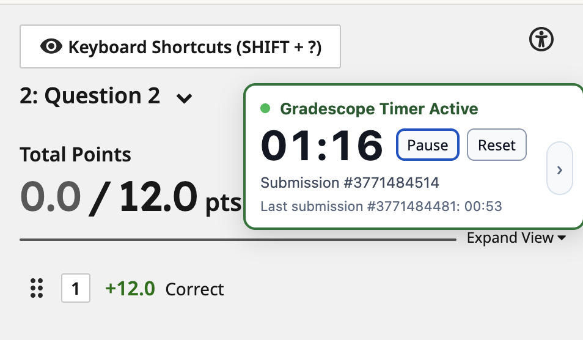

# Gradescope Submission Stopwatch

A Firefox extension that adds a grading timer directly to Gradescope submission pages.

It is designed for the common grading workflow where you move from one submission to the next inside Gradescope and want to keep track of how long each one takes.

## Install

1. Open Firefox and go to `about:debugging#/runtime/this-firefox`.
2. Click `Load Temporary Add-on...`.
3. Select `manifest.json` in this folder.
4. Open a Gradescope submission grading page.

For permanent installs, package and submit the extension to AMO with the Firefox manifest entry in `manifest.json`.

Note: the Gecko `id` in `manifest.json` is a temporary placeholder for local packaging/testing.

## Features

- Shows a clear stopwatch overlay on Gradescope grading pages
- Starts a fresh timer for each submission
- Supports `Pause`, `Resume`, and `Reset`
- Remembers time for each submission if you refresh the page
- Shows the previous submission's time under the current timer
- Includes a cumulative view for question-wide and current-session stats
- Lets you drag the timer overlay anywhere on the page

## Where it appears

The extension activates on grading URLs like:

`https://www.gradescope.com/courses/<course_id>/questions/<question_id>/submissions/<submission_id>/grade`

## Cumulative View

The side arrow opens a secondary view with:

- `Question cumulative time`: total stored time for this question
- `Session total`: total for earlier submissions visited in the current page-load session
- `Session average`: average over completed submissions in the current page-load session
- `Visited this session`: how many unique submissions you have visited in the current page-load session, excluding the current one from the average

A new session starts when the grading page is loaded normally, such as opening it from elsewhere or refreshing the page. Moving between submissions inside Gradescope's SPA keeps you in the same session.

## Project Files

- `manifest.json`: Firefox extension manifest
- `content.js`: timer logic, persistence, SPA handling, and UI behavior
- `styles.css`: overlay styling
- `icons/`: extension icons
